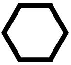
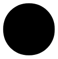
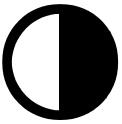

## Alchimie : Potions
Unlimited Power, page [81](https://thetrove.is/Books/Star%20Wars%20[multi]/FFG/Force%20and%20Destiny/Force%20and%20Destiny%20-%20(SWF52)%20Unlimited%20Power.pdf#page=84)  
[Retour](../index.md)

Comme les créations alchimiques sont toutes créées avec la Force d'une manière ou d'une autre, il y a quelques règles supplémentaires qui s'appliquent lors de la fabrication de ces objets. Premièrement, seuls les personnages sensibles à la Force peuvent tenter de créer une création alchimique. Toute autre personne qui tente de le faire se retrouve avec un objet ou un liquide qui n'a aucun effet surnaturel, quelle que soit la manière dont elle a suivi les instructions.

Deuxièmement, lorsqu'un personnage tente de réaliser une création alchimique, il doit lancer  égal à sa valeur de Force actuelle lors du test, et il doit avoir une valeur de Force actuelle d'au moins 1 pour pouvoir tenter le test (Cela a son importance si un personnage sensible à la Force a engagé un ou plusieurs  pour maintenir un pouvoir ou un talent de Force). Le personnage ne dépense pas les  ou  résultants du test pour générer . A la place, le personnage peut dépenser n'importe quel  généré sur le test pour obtenir un des effets listés dans le tableau des dépenses. De la même manière, le MJ peut dépenser n'importe quel  généré sur le test pour obtenir un des effets énumérés dans le même tableau. Ce sont les seules façons de dépenser  et  générés sur ce test.

#### Modèles de potions alchimiques

| Modèle | Coût en matériaux / Rareté | Test | Temps |
| --- | --: | --- | --- |
| Acide | 600 / 6 | Moyen () : Sang-froid ou Culture | 2h |
| Gorgée de feu | 400 / 5 | Difficile () : Sang-froid ou Culture | 3h |
| Elixir de vigueur | 600 / 6 | Difficile () : Sang-froid ou Culture | 4h |
| Potion de soin | 1000 / 5 | Moyen () : Sang-froid ou Culture | 2h |
| Poison | 500 / 4 | Facile () : Sang-froid ou Culture | 2h |
| Potion de volonté | 1000 / 8 | Intimidant () : Sang-froid ou Culture | 6h |
| Stimulant | 400 / 4 | Moyen () : Sang-froid ou Culture | 2h |
| Eau de Vie | 1000 / 10 | Exceptionnel () : Sang-froid ou Culture | 8h |
| Poison affaiblissant | 1000 / 6 | Difficile () : Sang-froid ou Culture | 4h |

#### Dépenser les , , , ,  et 

Symboles | Effets
--- | ---
,  ou  | **Fortifiant :** Si la potion a un effet bénéfique, la cible récupère une blessure en la consommant **Revigorant :** Si la potion a un effet bénéfique, la cible récupère deux points de stress en la consommant **Drain :** Si la potion a un effet néfaste, la cible subit deux points de stress en la consommant.
,  ou  | **Longue durée :** Si la potion est associée à une durée, celle-ci augmente d'une heure (ou un round dans le cas de rencontres structurées) **Mesures précises :** En mesurant précautionneusement les ingrédients, certains sont économisés pour plus tard. Le personnage conserve des ingrédients pour l'équivalent de 50% du coût de matériaux nécessaires à la confection de la potion (ne peut être sélectionné qu'une seule fois).
