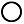
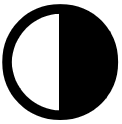

## Alchimie : Talismans
Unlimited Power, page [84](https://thetrove.is/Books/Star%20Wars%20[multi]/FFG/Force%20and%20Destiny/Force%20and%20Destiny%20-%20(SWF52)%20Unlimited%20Power.pdf#page=87)  
[Retour](../index.md)

Comme les créations alchimiques sont toutes créées avec la Force d'une manière ou d'une autre, il y a quelques règles supplémentaires qui s'appliquent lors de la fabrication de ces objets. Premièrement, seuls les personnages sensibles à la Force peuvent tenter de créer une création alchimique. Toute autre personne qui tente de le faire se retrouve avec un objet ou un liquide qui n'a aucun effet surnaturel, quelle que soit la manière dont elle a suivi les instructions.

Deuxièmement, lorsqu'un personnage tente de réaliser une création alchimique, il doit lancer  égal à sa valeur de Force actuelle lors du test, et il doit avoir une valeur de Force actuelle d'au moins 1 pour pouvoir tenter le test (Cela a son importance si un personnage sensible à la Force a engagé un ou plusieurs  pour maintenir un pouvoir ou un talent de Force). Le personnage ne dépense pas les  ou  résultants du test pour générer . A la place, le personnage peut dépenser n'importe quel  généré sur le test pour obtenir un des effets listés dans le tableau des dépenses. De la même manière, le MJ peut dépenser n'importe quel  généré sur le test pour obtenir un des effets énumérés dans le même tableau. Ce sont les seules façons de dépenser  et  générés sur ce test.

#### Modèles

Modèle | Coût en matériaux / Rareté | Test | Temps
--- | --: | --- | ---
[Amulette de Puissance](#amulette-de-puissance) |  500 / 6 | Difficile () : Sang-Froid ou Culture | 4h
[Fétiche de Peur](#fétiche-de-peur) | 300 / 4 | Moyen () : Sang-Froid ou Culture | 2h
[Accélérateur de Soins](#accélérateur-de-soins) | 600 / 5 | Intimidant () : Sang-Froid ou Culture | 8h
[Charme Neural](#charme-neural) | 1200 / 7 | Intimidant () : Sang-Froid ou Culture | 6h
[Amulette de Protection](#amulette-de-protection) | 300 / 4 | Facile () : Sang-Froid ou Culture | 3h
[Amulette de Bouclier](#amulette-de-bouclier) | 1000 / 8 | Intimidant () : Sang-Froid ou Culture | 2h
[Talisman de la Destinée](#talisman-de-la-destinée) | 4000 / 6 | Difficile () : Sang-Froid ou Culture | 10h
[Jeton de Résistance](#jeton-de-résistance) | 1800 / 9 | Exceptionnel () : Sang-Froid ou Culture | 8h

#### Dépenser les , , , ,  et 

Symboles | Effets
--- | ---
,  ou  | **Drain:** Si le talisman affecte un autre personnage de manière néfaste, ce personnage subit 1 point de stress après avoir résolu les effects du talisman. **But Caché :** Ajoute  à tout test réalisé pour déterminer la véritable fonction du talisman.
,  ou  | **Pouvoir grandissant :** Si le talisman est utilisé pour s'opposer à un test de compétence ennemi ou qu'un ennemi doit effectuer un test de compétence suite à l'activation du talisman, la difficulté de ce test est augmentée de 1.  **Vivifiant :** L'utilisateur récupère 1 point de stress après avoir utilisé le talisman. **Mesures précises :** En mesurant précautionneusement les ingrédients, certains sont économisés pour plus tard. Le personnage conserve des ingrédients pour l'équivalent de 50% du coût de matériaux nécessaires à la confection du talisman (ne peut être sélectionné qu'une seule fois).
,  ou  | **Puissance supplémentaire :** Si le talisman est utilisé pour infliger ou réduire des dommages, le montant infligé ou réduit est augmenté de 2. **Construction astucieuse :** L'artisant trouve une manière inspirée de façonner plus en utilisant la même quantité de matériaux, créant deux de ce talisman au lieu d'un.
,  ou  | **Schéma constructeur :** Crée une formule de construction qui réduit de façon permanente la difficulté pour créer ce type de talisman par 1 (jusqu'à un minimum de **Simple [-]**) **Redirection d'énergie :** Si le talisman permet de réduire des dommages ou de résister à une influence ennemie, l'utilisateur peut réaliser une manoeuvre unique en tant que broutille hors-tour une fois ses effets résolus.
 ou  | **Renforcé :** Si le talisman ne peut être utilisé qu'une fois par session ou est perdu après son usage, il peut à la place être utilisé deux fois par session ou dispose d'une utilisation supplémentaire avant d'être perdu (cela ne peut être sélectionné qu'une seule fois). **Puissant :** Si le talisman ajoute ou enlève des dés à un test, il ajoute ou enlève un dé supplémentaire de ce type (cela ne peut être sélectionné qu'une seule fois).
,  ou  | **Repérable :** Les utilisateurs de la Force ajoute  à tout test réalisé pour déterminer que le talisman est un objet fabriqué alchimiquement et non simplement un bijou décoratif ou un souvenir ornemental. **Encombrant :** Le talisman est confectionné maladroitement, augmentant son encombrement de 1.
,  ou  | **Mal à l'aise :** L'utilisateur subit 1 conflit après avoir utilisé le talisman. Confection bâclé : Le personnage a besoin d'ingrédients supplémentaires à cause d'erreurs de fabrication, et doit obtenir des matériaux supplémentaires avec un cout égal à 25% du coût de base.
,  ou  | **Difficile à contrôler :** L'utilisateur doit effectuer un **test de Sang-Froid Difficile ()** en tant que broutille (hors tour si nécessaire) afin d'activer le talisman. Animé par le Mal : L'utilisateur subit 2 points de conflit après avoir utilisé le talisman.
 ou  | **Destin tortueux :** L'utilisateur doit utiliser un point de Destin afin de pouvoir utiliser le talisman. **Echec d'activation :** Le talisman semble maudit, et sujet aux dysfonctionnements. Le MJ peut utiliser 2 points de Destin pour faire que le talisman échoue à fonctionner lorsque l'utilisateur le souhaite. Cela ne compte pas comme un usage en ce qui concerne sa durée, nombre d'usage par session ou avant d'être perdu.

### Talismans
#### Amulette de Puissance
Bien qu'il prenne souvent la forme d'un petit conglomérat d'éclats de cristal, ce talisman conserve en lui un lien fort avec la Force. Lorsqu'il est brisé, le porteur se retrouve avec une puissance supplémentaire dans ses capacités de la Force.
L'utilisateur peut utiliser ce talisman pour lancer un  supplémentaire lors d'un test de pouvoir de la Force ou lors de l'ajout d'un  à un test de compétence. Une fois utilisé, le talisman se fragmente en poussière.

#### Fétiche de Peur
Ce talisman irradie une aura de terreur chez quiconque cherche à attaquer celui qui le porte. De nombreux artisans les transforment délibérément en petites figurines grotesques ou en parties du corps, pour mieux en accentuer l'effet.
L'utilisateur peut choisir qu'un personnage ennemi qui tente de se déplacer au contact de lui doive d'abord effectuer un **test de Peur Moyen ()** en tant que broutille hors tour. Si le personnage réussit, il peut se déplacer comme il le souhaite. Si le personnage échoue, il ne peut pas effectuer la manoeuvre souhaitée mais peut toujours effectuer une autre manoeuvre à la place.

#### Accélérateur de Soins
Ce talisman déborde d'énergie, soulageant les esprits et réparant les corps. Il peut même recâbler des circuits ou souder du métal si nécessaire.
Lorsque le talisman est actif, lorsque l'utilisateur soigne du stress ou des blessures, il soigne cette quantité plus 1.

#### Charme Neural
Ce talisman est souvent porté sous la forme d'un diadème ou d'une paire de grandes boucles d'oreilles, et permet d'accélérer les processus de pensée même chez les êtres non organiques.  Bien que son utilisation soit éprouvante, il peut permettre à son porteur de se souvenir d'un fait essentiel juste à temps.
En portant ce talisman, lorsque l'utilisateur fait un test de connaissance, il peut subir un certain nombre de points de stress sans dépasser sa caractéristique d'Intelligence. S'il agit ainsi, il ajoute au test autant de  que de stress subi de cette manière.

#### Amulette de Protection
Prenant généralement la forme d'un anneau ou d'une broche, ce talisman entoure l'utilisateur d'une aura qui simule le confort de son environnement d'origine, quels que soient les dangers qui l'entourent.
Lorsqu'il est actif, le talisman permet à l'utilisateur d'ignorer les effets environnementaux tels que le feu, l'acide et les atmosphères corrosives. Ils agissent toujours comme dans un champ de gravité standard et peuvent respirer normalement, même sous l'eau et dans le vide. Les armes ayant la qualité Incendiaire ne comptent pas comme ayant cette qualité lorsqu'elles sont utilisées dans le cadre d'une attaque contre l'utilisateur.

#### Amulette de Bouclier
Ce petit objet, d'apparence décorative, protège celui qui le porte contre les attaques qui font appel à la Force pour les alimenter. De telles attaques se brisent comme des vagues contre les rochers grâce au pouvoir de l'amulette.
Si l'utilisateur devait subir des dommages lors d'une attaque où un pouvoir de la Force a été utilisé soit pour effectuer l'attaque, soit pour augmenter ses effets, il peut choisir de réduire de moitié les dommages infligés par l'attaque (arrondis à l'entier supérieur). Ce talisman ne peut être utilisé qu'une fois par session.

#### Talisman de la Destinée
Cette petite icône semble être faite d'un nombre impossible de fils multicolores, étroitement liés en une forme géométrique. Lorsque des forces s'élèvent pour menacer le porteur, les fils semblent se déplacer et, d'une certaine manière, annuler les menaces.
Chaque fois que le MJ retourne 1 point de Destin pour améliorer la capacité ou la difficulté d'un test de compétence impliquant l'utilisateur, ce dernier peut dégrader la difficulté du test une fois. Cela ne retourne pas le point de Destin du côté obscur. Ce talisman s'effondre et se dissout après une seule utilisation.

#### Jeton de Résistance
Souvent porté sur un collier comme une étoile d'éclats métalliques, ce fétiche agit pour amortir les pouvoirs de la Force utilisés pour faire basculer la pensée de celui qui le porte. Pour ceux qui craignent les tours d'esprit d'autrefois, il est essentiel de préserver sa propre perception.
Lorsque l'utilisateur est visé par un test opposé de compétence sociale où un pouvoir de Force a été utilisé pour effectuer ou augmenter le test, il peut choisir de faire en sorte que le personnage adverse lance 1  de moins dans le cadre du test. Si cela signifie qu'il n'y a pas assez de  pour que le test soit effectué ou que le pouvoir soit activé, le test échoue automatiquement.
