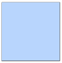

## Armures
Keaping the peace, page [90](https://thetrove.is/Books/Star%20Wars%20[multi]/FFG/Force%20and%20Destiny/Force%20and%20Destiny%20-%20(SWF24)%20Keeping%20the%20Peace.pdf#page=94)  
[Retour](../index.md)

#### Modèles

Modèle | Coût en matériaux / Rareté | Test | Temps | Profil
--- | --: | --- | --- | ---
Vêtements renforcés | 25 / 0 | Moyen () : Mécanique ou Survie | 6h | +1 encaissement, +0 défense, 1 encombrement, 0 emplacements
Armure légère	| 250 / 0 | Moyen () : Mécanique | 12h | +2 encaissement, +0 défense, 2 encombrement, 0 emplacements
Armure personnalisable | 500 / 4 | Moyen () : Mécanique | 16h | +1 encaissement, +0 défense, 4 encombrement, 4 emplacements
Armure de déviation | 500 / 5 | Moyen () : Mécanique | 24h | +1 encaissement, +1 défense, 2 encombrement, 1 emplacement
Armure de combat | 1250 / 4 | Difficile () : Mécanique | 48h | +2 encaissement, +0 défense, 4 encombrement, 3 emplacements
Armure segmentée | (R) 2,500 / 6 | Intimidant () : Méccanique | 72h | +2 encaissement, +1 défense, 6 encombrement, 4 emplacements
Armure améliorée | (R) 4,500 / 8 | Exceptionnel () : Mécanique | 120h | +2 encaissement, +2 défense, 6 encombrement, 6 emplacements

#### Dépenser les , , , ,  et 

Symboles | Effets
--- | ---
 ou  | **La pratique rend parfait :** Le personnage apprend quelque chose d'utile, et gagne  au prochain jet qu'il réalise avec la même compétence durant cette session. **Léger :** Reduit l'encombrement de l'armure par 1 (jusqu'à un minimum de 1). **Scellable :** L'armure couvre le corps entier, et devient compatible avec le kit "Vacuum Sealed" (cela ne peut être sélectionné qu'une seule fois).
 ou  | **Tirer les enseignements :** Réduit la difficulté du prochain test d'artisanat du personnage par 1. **Défense au Corps à Corps supplémentaire :** Ajoute +1 en défense au corps à corps à cette armure (cela ne peut être sélectionné qu'une seule fois). **Embellissement spécial :** Le porteur de cette armure ajoute  automatiquement à l'un des tests de compétences suivants : Charme, Coercition, Négociation, Commandement, Résistance ou Discrétion (cela ne peut être sélectionné qu'une seule fois).
 ou  | **Construction efficace :** Une part importante des matériaux n'est pas utilisée et peut être récupéré dans l'opération : le personnage conserve l'équivalent de 50% du coût de matériaux recquis pour la réalisation de l'objet (cela ne peut être sélectionné qu'une seule fois). **Défense à distance supplémentaire :** Ajoute +1 défense à distance à l'armure (cela ne peut être sélectionné qu'une seule fois). **Emplacement supplémentaire :** Ajoute 1 emplacement à l'armure (jusqu'à un maximum de 2 emplacements supplémentaires).
 ou  | **Encaissement supplémentaire :** Ajoute +1 encaissement à l'armure (cela ne peut être sélectionné qu'une seule fois). **Dupliquer :** Crée un ensemble d'armure identique supplémentaire (avec toutes les qualités, améliorations et défauts que le premier possède) sans surcoût. **Schéma d'armure :** Crée un schéma technique qui réduit de façon permanente la difficulté des tests pour créer une armure sur ce modèle par 1 (jusqu'à un minimum de **Simple [-]**) (cela ne peut être sélectionné qu'une seule fois).
 | **Kit intégral :** Ajoute +1 emplacement à l'armure, puis installe un kit compatible nécessitant 1 emplacement. Aucun test n'est requis pour obtenir ce kit, et il coûte 0 crédits.
 ou  | **Effort épuisant :** Après la réalisation de l'étape 3 : Construction, le personnage subit 3 points de stress. **Lourd :** Augmente l'encombrement de l'armure de +1. **Mal ajustée :** Enfiler et retirer cette armire nécessite 1 action supplémentaire (cela ne peut être sélectionné qu'une seule fois).
 ou  | **Complexe :** L'armure est difficile à maintenir. Augmente la difficulté des tests pour réparer cet objet de 1. **Difficile à personnaliser :** Augement la difficulté des tests pour modifier les kits de cette armure par 1. **Contraignante :** Le porteur de cette armure ajoute  automatiquement aux tests pour l'une des compétences suivantes : Athlétisme, Coordination, Perception, Magouilles ou Vigilance (cela ne peut être sélectionné qu'une seule fois).
 ou  | **Usure :** Les outils que le personnage a utilisé pour fabriquer l'armure sont abîmés ou détruits, et sont endommagés d'un cran (dommages mineurs si non endommagés, de mineur à modéré, de modéré à majeur). **Fragile :** L'armure a une vulnérabilité substantielle qui peut être exploitée : lorsque l'armure devient endommagée, elle compte comme subissant des dommages modérés, sauf si cela doit être supérieur.
 ou  | **Coûteuse :** L'armure a un mécanisme compliqué qui ne peut être remplacé qu'à un coût certain. Lorsqu'elle devient endommagée, le coût pour réparer l'armure est doublé (cela ne peut être sélectionné qu'une seule fois). **A court de ressources :** Le personnage tombe à court d'équipement au milieu de la construction de l'armure. L'artisant ne peut la terminer à moins d'avoir l'opportunité d'acquérir plus de fournitures et qu'il dépense des crédits équivalents à 25% du coût de matériaux sur ces éléments supplémentaires (cela ne peut être sélectionné qu'une seule fois).
 | **Défaut inattendu :** L'armure a un problème sérieux que l'artisant n'a pas détecté. A un moment dans le futur, le MJ peut dépenser un point de Destin pour faire tomber l'armure en défaut. Lorsque cela se produit, l'armure est considérée comme souffrant de dommages majeurs, et devient donc inutilisable. Une fois que l'armure a été réparée, ce défaut est enlevé et ne peut plus être exploité à nouveau (cela ne peut être sélectionné qu'une seule fois).
