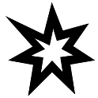
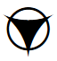

## Droïdes
Special Modifications, page [80](https://thetrove.is/Books/Star%20Wars%20[multi]/FFG/Edge%20of%20the%20Empire/Edge%20of%20the%20Empire%20-%20%28SWE14%29%20Special%20Modifications.pdf#page=84)  
[Retour](../index.md)

Lors de la construction d'un droïde, l'artisant effectue d'abord les étapes 1 à 3 normalement, en choisissant un modèle de châssis de droïde, en acquérant les matériaux et en effectuant les tests indiquées pendant le temps spécifié. Une fois que l'artisant a terminé l'étape 3 : Construction avec succès (en passant les heures requises et en réussissant le test indiqué, comme d'habitude), le personnage termine le châssis du droïde, mais ce n'est qu'une coquille sans vie jusqu'à ce qu'elle soit imprégnée d'une étincelle d'intelligence animée. À ce stade, le mécanicien peut passer à l'étape 4 : Directives du programme, en choisissant l'un des modèles de directives pour droïdes et en effectuant le test indiquée pendant le temps requis.

Si le personnage échoue, la seule chose perdue est le temps du mécanicien.  Le personnage peut tenter l'étape 4 : Directives de programme à la prochaine occasion. Si le personnage réussit, le droïde est mis en ligne après le nombre d'heures de travail indiqué dans le modèle sous "Temps". Chaque  que le personnage obtient sur le test au-delà du premier réduit ce temps de 2 heures (à un minimum d'une heure). D'autres facteurs peuvent également influer sur le temps nécessaire, à la discrétion du MJ. Une fois en ligne, le droïde est un PNJ qui possède les caractéristiques et autres attributs déterminés à l'étape 3 : Construction et les compétences, talents et autres aptitudes déterminées à l'étape 4 : Directives du programme.

### Chassis

#### Modèles de Chassis

| Modèle | Coût en matériaux / Rareté | Test | Temps |
| --- | --: | --- | --- |
[Chassis monotâche](#chassis-monotâche) | 600 / 2 | Moyen () : Mécanique | 1j (24h)
[Chassis de travail](#chassis-de-travail) | 3500 / 3 | Moyen () : Mécanique | 2j (48h)
[Chassis de combat](#chassis-de-combat) | (R) 3250 / 4 | Difficile () : Mécanique | 2j (48h)
[Chassis spécialiste](#chassis-spécialiste) | 4500 / 3 | Intimidant () : Mécanique | 3j (56h)
[Chassis de combat avancé](#chassis-de-combat-avancé) | (R) 32500 / 7 | Exceptionnel () : Mécanique | 10j (240h)

##### Chassis monotâche [Sbire]

**Capacités :** Droïde (n'a pas besoin de respirer, manger, ou boire, et peut survivre dans le vide ou sous l'eau; immunisé contre les poisons ou les toxines), Gabarit 0.

##### Chassis de travail [Sbire]

**Capacités :** Droïde (n'a pas besoin de respirer, manger, ou boire, et peut survivre dans le vide ou sous l'eau; immunisé contre les poisons ou les toxines), Gabarit 1.

##### Chassis de combat [Sbire]

**Capacités :** Droïde (n'a pas besoin de respirer, manger, ou boire, et peut survivre dans le vide ou sous l'eau; immunisé contre les poisons ou les toxines), Gabarit 1.

##### Chassis spécialiste [Rival]

**Capacités :** Droïde (n'a pas besoin de respirer, manger, ou boire, et peut survivre dans le vide ou sous l'eau; immunisé contre les poisons ou les toxines), Gabarit 1.

##### Chassis de combat avancé [Nemesis]

**Capacités :** Droïde (n'a pas besoin de respirer, manger, ou boire, et peut survivre dans le vide ou sous l'eau; immunisé contre les poisons ou les toxines), Gabarit 1.

#### Dépenser les , ,  et  dans la fabrication du chassis

Symboles | Effets
--- | ---
 ou  | **La pratique rend parfait :** Le personnage apprend quelque chose de précieux, et gagne `bo` au prochain jet qu'il fait avec la même compétence avant la fin de la session. **Chassis renforcé :** Augmente le seuil de blessure du droïde de 1. **Discret :** Le droïde gagne un rang du talent Quelconque (cela ne peut être sélectionné qu'une seule fois).
 ou  | **Tirer les enseignements :** Réduit la difficulté du prochain test d'artisanat du personnage par 1. **Carapace déflective :** Augmente la défense au corps à corps du droïde par 1 (jusqu'à un maximum de 2). **Profil fin :** Augmente la défense à distance du droide de 1 (jusqu'à un maximum de 2).
 ou  | **Blindage :** Augmente l'encaissement du droïde de 1 (cela ne peut être sélectionné qu'une seule fois). **Taille inhabituelle :** Augmente ou réduit le gabarit du droïde de 1, jusqu'à un minimum de 0 (cela ne peut être sélectionné qu'une seule fois). **Matériel modulaire :** Choisissez un implant cybernétique. Le droïde est déjà installé de cet implant sans surcoût (cela ne peut être sélectionné qu'une seule fois).
 ou  | **Plan de chassis :** Crée un schéma technique qui réduit de façon permanente la difficulté de créer un chassis de droïde sur ce modèle par 1 (jusqu'à un minimum de **Simple [-]**). **Matériel supérieur :** Augmente une caractéristique du droïde par 1 (jusqu'à un maximum de 6).
 | **Doppleganger :** Construit un droïde additionnel identique lors de l'opération.
 ou  | **Effort épuisant :** Après avoir complêté l'étape 3 : Construction, le personnage subit 3 points de stress. **Matériel spécialisé :** Le doïde subit `sb` aux tests de compétences pour lesquels il ne dispose d'aucun rang.
 ou  | **Difficile à personnaliser :** Augmente la difficulté des tests pour installer de la cybernétique sur ce droïde par 1.
 ou  | **Usure :** Les outils dont le personnage s'est servi pour fabriquer le doïde sont abîmés ou détruits, et sont endommagés d'un rang (mineur si intact, de mineur à modéré, de modéré à majeur).
 ou  | **Mécanismes délicats :** Augmente la difficulté des tests pour réparer ce droïde par 1. **Coeur de puissance erratique :** Une fois par session, le MJ peut dépenser `de` lors d'un test réalisé par le droïde pour faire en sorte qu'il s'éteigne jusqu'à la fin de la rencontre (cela ne peut être sélectionné qu'une seule fois).
 | **Coeur de puissance volatile :** Lorsque ce droïde subit une Blessure Critique, ajoute +50 au résultat. Si la Blessure Critique tue le droïde, il explose et chaque personnage au contact subit 10 dommages (cela ne peut être sélectionné qu'une seule fois).

### Directives

#### Modèles de Directives

Modèle | Test | Temps
---|---|---
[Directives de travail](#directives-de-travail) | Facile (`di`) : Informatique | 8h
[Directives de combat](#directives-de-combat) | Moyen (`di``di`) : Informatique | 16h
[Directives de traduction](#directives-de-traduction) | Difficile (`di``di``di`) : Informatique | 1j (24h)
[Directives de réparation](#directives-de-réparation) | Difficile (`di``di``di`) : Informatique | 1j (24h)
[Directives de naviguation](#directives-de-naviguation) | Difficile (`di``di``di`) : Informatique | 3j (72h)
[Directives de soin](#directives-de-soin) | Intimidant (`di``di``di``di`) : Informatique | 3j (72h)
[Directives d'élimination](#directives-d-élimination) | Exceptionnel (`di``di``di``di``di`) : Informatique | 7j (168h)

#### Directives de travail
De nombreux droïdes sont programmés pour accomplir une tâche unique, avec juste assez de protocoles d'interaction pour se débrouiller dans les autres circonstances. De tels droïdes tendent à avoir une bien pauvre conversation, puisqu'ils sont généralement obsédés par leur seul domaine d'expertise.

**Compétences :** 2 rangs dans une unique compétence Générale. Si le droïde est un sbire, ajoutez cette compétence aux compétences du groupe à la place.

#### Directives de combat
Les véritables droïdes de combat sont interdits sous le gouvernement de l'Empire, mais de nombreux techniciens construisent encore des droïdes à des fins de sécurité, pour repousser les pirates ou autres maraudeurs. Certaines sociétés vendent également de tels droïdes, et en quantité suffisante pour être considérées comme de petites armées.

**Compétences :** 1 rang dans trois compétences de combat différentes (voir page 103 de l'EDGE of THE EMPIRE Core Rulebook). Si le droïde est un sbire, ajoutez plutôt ces compétences à celles de son groupe.

**Talents :** Garde du corps 1 (une fois par tour, peut effectuer la manoeuvre Garde du Corps : subir 1 stress pour améliorer la difficulté de tous les tests de combat contre un allié au contact jusqu'au début du prochain tour du droïde).

#### Directives de traduction
Les droïdes traducteurs, en particulier ceux qui sont spécialisés dans l'étiquette et le protocole, sont très précieux aux confins de la galaxie. En raison de leur anatomie unique, de nombreuses espèces ne peuvent pas parler le Basic sans une assistance mécanique quelconque, et sur les mondes reculés, les habitants parlent souvent une langue ou un dialecte local plutôt que la langue la plus courante de la Galaxie. 

**Compétences :** 1 rang dans trois différentes compétences de Connaissance, Charme 1. Si le droïde est un sbire, ajoutez ces compétences à ses compétences de groupe à la place.

**Talents :** Persuasion 1 (Retire `sb` des tests de Magouilles et Tromperie), Irrésistible 1 (Retire `sb` des tests de Charme et de Commandement). 

#### Directives de réparation
Avoir un droïde capable de réparer des machines est un luxe que de nombreux machinistes de la Bordure Extérieure ne peuvent pas se permettre. Un tel droïde est une bénédiction pour tout garage, car il accomplit des tâches avec la précision et la patience qui font défaut à la plupart des êtres organiques.

**Compétences :** Informatique 1, Mécanique 2. Si le droïde est un sbire, ajoutez plutôt ces compétences à ses compétences de groupe.

**Talents :** As de la Mécanique 1 (Supprime `sb` des tests de Mécanique), Réparations Solides 1 (lors de la réparation des dégâts de coque avec un test de Mécanique, répare un dégât de coque supplémentaire) . 

#### Directives de naviguation
L'astronavigation est difficile et fastidieuse pour la plupart des gens, et les risques d'échec sont stupéfiants. De nombreux pilotes préfèrent confier les rênes à une machine fiable.

**Compétences :** Astrogation 2, Informatique 1, Pilotage (espace) 1. Si le droïde est un sbire, ajoutez plutôt ces compétences à ses compétences de groupe.

**Talents :** Cartographie de la Galaxie 1 (Supprime `sb` des tests d'Astrogation; les tests d'Astrogation prennent 50% de temps en moins), Génie de l'Informatique 1 (les tâches liées à l'Informatique prennent 25% de temps en moins).

#### Directives de soin
Les droïdes médicaux de pointe sont omniprésents dans les Mondes du Noyau, effectuant des opérations chirurgicales avec une compétence préternaturelle. Ceux que l'on trouve dans les mondes marginaux sont souvent fait-maison, mais peuvent toujours être très utiles à une colonie ou à un vaisseau.

**Compétences :** Connaissances (Xénologie) 1, Médecine 2. Si le droïde est un sbire, ajoutez ces compétences à celles de son groupe à la place.

**Talents :** Spécialiste du bacta 1 (les patients sous la supervision du droïde guérissent une blessure supplémentaire à chaque fois qu'ils soignent une blessure), Chirurgien 1 (lorsqu'il soigne des blessures avec un test de Médecine, soigne 1 blessure supplémentaire). 

#### Directives d'élimination
Contrairement à la plupart des droïdes de combat, qui reposent sur le poids du nombre, les droïdes assassins sont des instruments de précision, aussi capables dans leur art brutal que toute créature organique.

**Némésis :** Si son châssis n'en fait pas déjà un PNJ Nemesis, un droïde programmé avec des directives d'élimination devient un Nemesis ; il gagne un seuil de stress égal à son seuil de blessure.

**Compétences :** 4 rangs dans trois compétences de combat différentes, Calme 2, Connaissance (Xénologie) 1, Mécanique 2, Discrétion 2.

**Talents :** Adversité 2 (Améliore deux fois la difficulté de tous les tests de combat contre cette cible). Coup mortel 3 (+30 à tous les jets de Blessures Critiques effectués contre les adversaires). 

#### Dépenser les , ,  et  dans l'implémentation de directives

Symboles | Effets
--- | ---
 ou  | **Manie positive aléatoire :** Ajoutez 1 trait de personnalité positif sélectionné aléatoirement dans la table des [traits de caractère](#traits-de-caractère) au droïde (cela ne peut être sélectionné qu'une seule fois). **Fonctions d'archivage :** Ajout une nouvelle compétence de Connaissance au rang 1 au droïde; si le droïde est un sbire, ajoute cette compétence aux compétences du groupe à la place (cela ne peut être sélectionné qu'une seule fois).
 ou  | **Programmation adaptative :** Ajoute 1 rang dans une compétence que le droïde possède. Cela ne peut s'appliquer aux sbires. **Utilité variée :** Ajoute une compétence Générale au rang 1 au droïde. Si le droïde est un sbire, ajoute cette compétence aux compétences de groupe à la place (cela ne peut être sélectionné qu'une seule fois). **Manie positive :** Ajoutez 1 trait de personnalité à l'invention de l'artisant ou choisi dans la table des [traits de caractère](#traits-de-caractère) au droïde (cela ne peut être sélectionné qu'une seule fois).
 ou  | **Programmation défensive :** Ajoute une nouvelle compétence de combat au rang 1 au droïde; si le droïde est un sbire, cette compétence s'ajoute aux compétences du groupe à la place. **Optimisation comportementale :** Ajoute 1 rang à n'importe quel talent que le droïde possède (cela ne peut être sélectionné qu'une seule fois).
 | **Modèle de programme :** Crée un programme qui réduit de façon permanente la difficulté de programmer des droïdes avec cette directive par 1 (jusqu'à un minimum de **Simple [-]**)
 ou  | **Excentrique :** Ajoute un trait de personnalité négatif sélectionné aléatoirement dans la table des [traits de caractère](#traits-de-caractère) au droïde (cela ne peut être sélectionné qu'une seule fois).
 ou  | **Faible capacité d'écoute :** Ajoute `sb``sb` aux tests visant à donner des ordres au droïde (cela ne peut être sélectionné qu'une seule fois).
 ou  | **Manie négative :** Ajoute un trait de personnalité négatif à l'invention du MJ ou sélectionné dans la table des [traits de caractère](#traits-de-caractère) au droïde (cela ne peut être sélectionné qu'une seule fois). **Programmation limitée :** Le droïde améliore une fois la difficulté des tests de compétence pour lesquelles il ne dispose d'aucun rangs.
 | **Défaut inconnu :** Ajoute au droïde un défaut négatif secret à l'invention du MJ ou choisi dans la table des [traits de caractère](#traits-de-caractère). Le MJ est responsable de comment - et si - ce trait de personnalité entre en jeu.

#### Traits de caractère

d100 | Trait positif | Trait négatif
--- | --- | ---
01-10 | **Loyal :** Le droïde place les besoins de son créateur au dessus des siens, et cherche toujours des moyens d'aider, qu'on le lui demande ou non. | **Lâche :** Ce droïde place la survie en première priorité, et se tient à l'écart de tout danger potentiel.
11-20 | **Ingénieux :** Certains droïdes sont capables de s'adapter à un problème rapidement, et ne restent pas enfermés dans leur propre programmation étroite. | **Trop littéral :** Beaucoup de droïdes (et certains êtres pensants organiques) peinent à voir les nuances de langage au delà du sens premier. Ce droïde en fait partie.
21-30 | **Patient :** A la différence des êtres organiques, les droïdes sont théoriquement immortels tant qu'ils reçoivent une maintenance adéquate. Ainsi, un droïde peut avoir une patience dont même les êtres à la plus grande longévité peuvent manquer. | **Arrogant :** Qu'il pense avoir été construit mieux que les autres droïdes ou qu'il croie être intrinsèquement supérieur à d'autres formes de vies plus temporaires, ce droïde a une haute opinion de ses capacités.
31-40 | **Enthousiaste :** Ce droïde a une capacité infinie à voir des opportunités, et ne manque pas de les faire remarquer. | **Impulsif :** Ce droïde a une capacité infinie à voir des opportunités, et les saisit habituellement sans prévenir.
41-50 | **Compatissant :** Certains droïdes sont très attentionnés et s'efforcent de cultiver le meilleur de ceux qui les entourent | **Impitoyable :** Il peut être malveillant, ou il peut simplement considérer l'émotion comme inefficace, mais ce droïde détruit tout ce qui se met en travers de son chemin.
51-60 | **Efficace :** Ce droïde déteste le gaspillage, et il fait tout de la manière la plus rapide et précise qu'il le peut. | **Fainéant :** Les droïdes sont construits pour réaliser certains buts, mais ce droïde n'est pas particulièrement intéressé de le faire s'il peut l'éviter.
61-70 | **Bien éduqué :** Ce doïde conserve toujours une parfaite étiquette, même lorsqu'il doit faire affaire avec des individus qu'il n'aime pas particulièrement. | **Abrasif :** Faire affaire avec ce droïde est particulièrement frustrant. Qu'il réponde avec sarcasme, ou pas du tout, ses mots et ses actions sont piquants.
71-80 | **Joyeux :** Une bonne attitude est le premier pas vers le succès (du moins c'est ce que pense ce droïde). | **Pessimiste :** Un malheur apparent guette ce droïde à chaque coin de rue, et il exprime cette conviction à chaque occasion.
81-90 | **Fiable :** Ce droïde est toujours utile à son créateur ou à ses amis. | **Déséquilibré :** La seule certitude avec ce droïde est que ses décisions ne sont pas prévisibles
91-95 | Le MJ invente ou choisit un trait de personnalité positif. | Le joueur invente ou choisit un trait de personnalité négatif.
96-100| Le joueur invente ou choisit un trait de personnalité positif puis tire un autre trait dans cette table. | Le MJ invente ou choisit un trait de personnalité négatif puis tire un autre trait dans cette table.