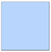

## Gadgets
Special Modifications, page [84](https://thetrove.is/Books/Star%20Wars%20[multi]/FFG/Edge%20of%20the%20Empire/Edge%20of%20the%20Empire%20-%20%28SWE14%29%20Special%20Modifications.pdf#page=88)  
[Retour](../index.md)

#### Modèles

| Modèle | Coût en matériaux / Rareté | Test | Temps |
| --- | --: | --- | --- |
Outil simple | 50 / 1 | Facile () : Mécanique | 2h
Outil spécialisé | 400 / 4 | Moyen () | 10h
Instrument de précision | 150 / 3 | Difficile () | 16h

#### Profils

Nom | Encomb | Effet | Exemple
---|---|---|---
Outil simple | 4 | Choisissez une compétence Générale; l'outil permet au personnage de réaliser des tests avec cette compétence. A la discrétion du MJ , cet outil compte comme approprié pour la tâche à effectuer. | Matériel d'escalade, datapad, scanner à main, medkit d'urgence, trousse à outils, matériel de slicer
Outil spécialisé | 8 | Choisissez une compétence Générale; Ajoutez un  automatique aux tests réalisés avec cette compétence | Cuve à bacta, antenne scanner, scie de table, matériel de soudure
Instrument de précision | 5 | Choisissez une compétence Générale; Retirez  des tests avec cette compétence | Microscope, cape thermique, lunettes scanners

#### Dépenser les , ,  et 

Symboles | Effets
--- | ---
 ou  | **Léger :** Réduit l'encombrement du gadget de 1 (jusqu'à un minimum de 1). **La pratique rend parfait :** Le personnage apprend quelque chose de précieux, et gagne  au prochain test fait avec la même compétence jusqu'à la fin de la session.
 ou  | **Compact :** Si le gadget a un encombrement de 3 ou moins, ajoute  aux tests faits par d'autres personnages pour le trouver sur son porteur (jusqu'à un maximum de ). **Tirer les enseignements :** Réduit la difficulté du prochain test d'artisanat du personnage de 1.
 ou  | **Construction efficace :** Une part importante de matériaux est inutilisé et peut être récupéré dans l'opération; le personnage conserve des ressources pour l'équivalent de 50% du coût de matériaux requis pour la construction de l'objet (cela ne peut être choisi qu'une seule fois). **Fonctions de sécurité :** Ajoute  automatiquement aux tests de la compétence Générale choisie pour cet outil (cela ne peut être sélectionné qu'une seule fois).
 ou  | **Arme incluse :** Choisissez une arme d'encombrement 2 ou moins que le personnage possède afin de l'inclure dans le gadget; ajoutez  aux tests pour déterminer que le gadget contient une arme (cela ne peut être sélectionné qu'une seule fois).
 | **Art suprème :** Choisissez une compétence Générale; améliorez une fois les tests de cette compétence faits avec cet outil.
 ou  | **Effort épuisant :** Après la complétion de l'étape 3 : Construction, le personnage subit 3 stress. **Lourd :** Augmente l'encombrement du gadget de 1.
 ou  | **Difficile à réparer :** Augmente la difficulté des tests pour réparer ce gadget de 1. **Délicat :** Le MJ peut dépenser  ou  à n'importe quel test fait avec le gadget pour l'endommager d'un rang (mineur si intact, mineur à modéré, modéré à majeur) (cela ne peut être sélectionné qu'une seule fois).
 ou  | **Pas présentable :** Réduit le prix de base que les autres sont prêts à payer pour cet objet de 50% (cela ne peut être sélectionné qu'une seule fois).
 ou  | **Fragile :** A chaque fois que cet objet est endommagé d'un rang, il est endommagé de 2 rangs à la place (cela ne peut être sélectionné qu'une seule fois).
 | **Défectueux :** Lorsque le personnage utilise cet outil pour un test, améliore la difficulté de ce test une fois.
