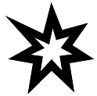

## Poignées de Sabres lasers
Endless Vigil, page [84](https://thetrove.is/Books/Star%20Wars%20[multi]/FFG/Force%20and%20Destiny/Force%20and%20Destiny%20-%20(SWF30)%20Endless%20Vigil.pdf#page=87)  
[Retour](../index.md)

#### Modèles

Modèle | Coût en matériaux / Rareté | Test | Temps | Exemple
--- | --: | --- | --- | ---
Sabre laser standard | 100 / 4 | Moyen () : Mécanique | 6h | Sabre laser
Sabre laser de précision | 150 / 5 | Moyen () : Mécanique | 12h | Shoto, dague laser, fleuret laser
Sabre laser défensif | 300 / 6 | Difficile () : Mécanique | 12h | Shoto de garde
Sabre laser à double lame | 300 / 5 | Difficile () : Mécanique | 12h | Sabre laser à double lame, Pique laser de gardien du Temple
Hampe laser | 150 / 5 | Difficile () : Mécanique | 12h | Pique laser, sabre laser à poignée longue

#### Profils

Nom | Encom | Empl | Spécial | Manipulation | Autre
--- | --- | --- | --- | --- | --- | --- | --- | ---
Poignée de Sabre laser standard | 1 | 5 | | Une main |
Poignée de Sabre laser de précision | 1 | 3 | Précis 1 | Une main | -1 dégâts aux cristaux installés
Poignée de Sabre laser défensif | 1 | 3 | Parade 1 | Une main | -1 dégâts aux cristaux installés
Poignée de Sabre laser à double lame | 2 | 4 | Jumelé 1, Difficile à manier 3 | Deux mains | Les kits et cristaux ont un coût doublé
Hampe laser | 2 | 4 | Encombrant 3, Parade 1 | Deux mains | 

##### Exemples avec un cristal d'Ilum

Nom | Compétence | Dég | Crit | Portée | Encom | Empl | Spécial | Manipulation | Autre
--- | --- | --- | --- | --- | --- | --- | --- | --- | ---
Sabre laser standard | Sabre laser | 6 | 2 | Au contact | 1 | 5 | Brèche 1, Briseur | Une main | |
Poignée de Sabre laser de précision | Sabre laser | 5 | 2 | Au contact | 1 | 3 | Précis 1, Brèche 1, Briseur | Une main | -1 dégâts aux cristaux installés
Poignée de Sabre laser défensif | Sabre laser | 5 | 2 | Au contact | 1 | 3 | Brèche 1, Parade 1, Briseur | Une main | -1 dégâts aux cristaux installés
Poignée de Sabre laser à double lame | Sabre laser | 6 | 2 | Au contact | 2 | 4 | Brèche 1, Jumelé 1, Difficile à manier 3, Briseur | Deux mains | Les kits et cristaux ont un coût doublé
Hampe laser | Sabre laser | 6 | 2 | Au contact | 2 | 4 | Brèche 1, Encombrant 3, Parade 1, Briseur | Deux mains | 

#### Dépenser les , ,  et 

Symboles | Effets
--- | ---
 ou  | **Léger :** Réduit l'encombrement du sabre laser de 1 (jusqu'à un minimum de 1). **A deux mains :** Augmente les dommages du sabre laser de 1 et son encombrement par 2; il nécessite maintenant d'être manipulé à deux mains (cela ne peut être sélectionné qu'une seule fois et ne peut être sélectionné pour un sabre laser à deux mains).
 ou  | **Camouflé :** Ajoute  aux tests que d'autres personnages font pour identifier la poignée tant qu'elle n'est pas allumée. **Contrepoids :** Augmente l'encombrement du sabrelaser de 2; il perd la qualité Difficile à manier et gagne la qualité Encombrant avec la même valeur (cela ne peut être sélectionné qu'une seule fois).
 ou  | **Garde droite :** La poignée du sabre laser gagne une garde droite. Il gagne la qualité Parade 1 (ou augmente la valeur de sa qualité Parade de 1), et l'utilisateur peut dépenser  ou  pour accrocher la lame de son adversaire et le désarmer (cela ne peut être sélectionné qu'une seule fois). **Personnalisable :** Augmente les emplacements du sabre laser de 1 (cela ne peut être sélectionné qu'une seule fois). **Equilibre délicat :** Le sabre laser perd la qualité Encombrant et gagne la qualité Difficile à Manier avec la même valeur (cela ne peut être sélectionné qu'une seule fois). **Conception personnalisée :** Quand l'artisant réussi un test de Sabre laser avec cette arme, ajoute  automatiquement au résultat. Ajoute  aux tests de Sabre laser que d'autres personnages font avec ce sabre laser (cela ne peut être sélectionné qu'une seule fois).
 ou  | **Intégré :** La poignée est construite comme faisant partie d'un autre objet, tel qu'un objet ou une arme. Choisissez un objet approprié d'encombrement 1 ou plus que le personnage possède et augmentez son encombrement par celui de la poignée du sable laser; la poignée fait partie de cette objet. Tant que le sabre laser est allumé, le porteur ne peut faire l'usage normal de l'objet original et doit dépenser une mannoeuvre pour changer la fonction de l'objet. (Cela ne peut être sélectionné qu'une seule fois) **Perte d'énergie :** Le sabre laser gagne la qualité Etourdissant 2 (ou augmente la valeur de la qualité Etourdissant de 2).
 | **Emetteur bien réglé :** Ajoute  automatiquement aux tests de combat fait avec ce sabre laser (cela ne peut être sélectionné qu'une seule fois). **Incrustation personnalisée :** Réduit la difficulté des tests pour modifier tout cristal installé dans cette arme de 1 (cela ne peut être sélectionné qu'une seule fois).
 | **Kit intégral :** Ajoute +1 emplacement à l'arme, puis lui installe un kit compatible requérant 1 ou moins emplacement et n'étant pas un cristal de sabre laser. Aucun jet n'est nécessaire pour obtenir le kit, et il coûte 0 crédit.
 ou  | **Lourd :** Augmente l'encombrement du sabre laser de 1. **Effort épuisant :** Après la complétion de l'étape 3: Construction, le personnage subit 3 points de stress.
 ou  | **Etrangement pesant :** Le sabre laser gagne la qualité Encombrant 2 (ou augmente la valeur de la qualité Encombrant de 2). **Boîtier fragile :** Augmente la difficulté des tests pour réparer ce sabre laser de 1.
 ou  | **Prise maladroite :** Le sabre laser gagne la qualité Difficile à manier 2 (ou augmente la valeur de la qualité Difficile à manier de 2). **Emetteur mal aligné :** Le sabre laser nécessite une manoeuvre pour s'allumer plutôt qu'une broutille; il peut toujours être éteint au prix d'une broutille (cela ne peut être sélectionné qu'une seule fois).
 ou  | **Erratique :** Une fois par rencontre de combat, le MJ peut dépenser  de n'importe quel test de combat fait avec ce sabre laser pour faire que son énergie interne se propage, causant des dommages à la poignée et électrocutant le porteur. L'endommagement du sabre laser progresse d'un pas (mineur à modéré, modéré à majeur, etc.) et le porteur subit 3 points de stress. (Cela ne peut être sélectionné qu'une seule fois) **Lentille de focalisation de mauvaise qualité :** Le sabre laser gagne la qualité Imprécis 1 (ou augmente sa valeur de qualité Imprécis de 1). Si l'objet a une qualité Précis, réduisez la valeur de cette qualité de 1 à la place.
 | **Défaut d'incrustation :** Augmente la difficulté des tests pour modifier tout cristal de sabre laser installé dans cette arme de 1 (cela ne peut être sélectionné qu'une seule fois). **Accident tragique :** Durant le processus de fabrication de la poignée, l'utilisateur se déconcentre à un moment clef, et celui-ci subit une blessure majeure. Après la complétion de l'étape 3 : Construction, le personnage subit une Blessure Critique. (Cela ne peut être sélectionné qu'une seule fois)
 | **Instable :** Le MJ peut dépenser  lors d'un test de combat avec ce sabre laser pour faire en sorte qu'il crachote et court-circuite. Il reste inoppérant jusqu'à ce qu'il soit réparé au moyen d'un **test de Mécanique Moyen ()**
 (Test échoué) | **Expérience enrichissante :** L'artisant apprend des techniques précieuses lors de l'essai; ce PJ gagne  à son prochain essai pour fabriquer une poignée et n'a pas besoin d'acheter de nouveaux matériaux.
 (Test échoué) | **Horrible accident :** Non seulement l'artisant échoue à concevoir une poignée fonctionnelle, mais le mécanisme de la poignée explose. L'artisant subit une Blessure Critique en ajoutant +20 au lancer, et tous les matériaux sont détruits.
